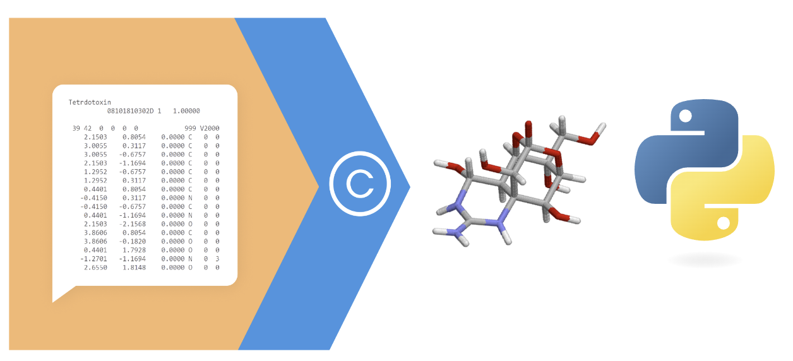

# CORINA Classic Goes Python


**CORINA Classic** is a rule- and data-based, automatic, fast, and powerful 3D molecular model builder optimized for small to medium-sized, drug-like molecules and is the _de facto_ industry standard for 3D structure generation in chemoinformatics and computational chemistry projects. Developed in C, CORINA Classic offers both standalone executables and a shared Python library. This repository showcases some example usages of the Python shared library.

For detailed information about CORINA Classic, visit the [CORINA Classic home page](https://mn-am.com/products/corina/).

##  Getting Started: Python & Jupyter Notebooks

To execute the examples in this repository, you must have a copy of the Python library of CORINA Classic. Note that all CORINA Classic products are commercial. To obtain an evaluation copy, please refer to the [CORINA Classic home page](https://mn-am.com/products/corina/).

### System Requirements

- Operating system: x86-64 Linux (RHEL7)
- Python compatibility: Python 3.8 to 3.11
- The library is as a shared object file that must be copied to the working directory as a file named "corina.so"

### Using the Python library

1. Check the Python version installed as follows.
   ```shell
   python3 --version
   # Output example: Python 3.10.7
   ```

2. From the Python library distribution of CORINA Classic, copy the appropriate "corina.so" for your Python version to your working directory.

3. Create a test Python script. Below is a simple example.

```python
import corina

# Create an instance of CorinaBuffer
buffer = corina.CorinaBuffer()

# Example with "hard coded" SMILES string
smiles = "CCCCC"

# Specify that the inpout type is SMILES string anf that the output format is SDF V3000
buffer.command = "corina -i t=smiles -o t=sdf3"
buffer.input = smiles

buffer.proceed()


# print output
print(buffer.output)

```
The API  mimics the command line syntax of the standalone version of CORINA Classic. 
All possible options for the command line are described in the CORINA Classic manual.


4. Execute the Python script.


```shell
python3 test.py > mol.v3000.sdf

```

This command will output an SDF V3000 compatible file with 3D atom coordinates.


### Creating a Jupyter Notebook

1. Ensure the Python library of CORINA Classic is set up as described above.
2. Install Jupyter Notebook (preferably within a virtual environment) as shown below.

```shell
mkdir jupyter
cd jupyter
virtualenv environment
source environment/bin/activate
pip install jupyter
 ```

3. Launch Jupyter Notebook:
```shell
jupyter notebook
```

4. Create a new notebook.


5. Run a simple example.


## CORINA Classic API

The Python file python/corina_api.py shows all features of the API.

